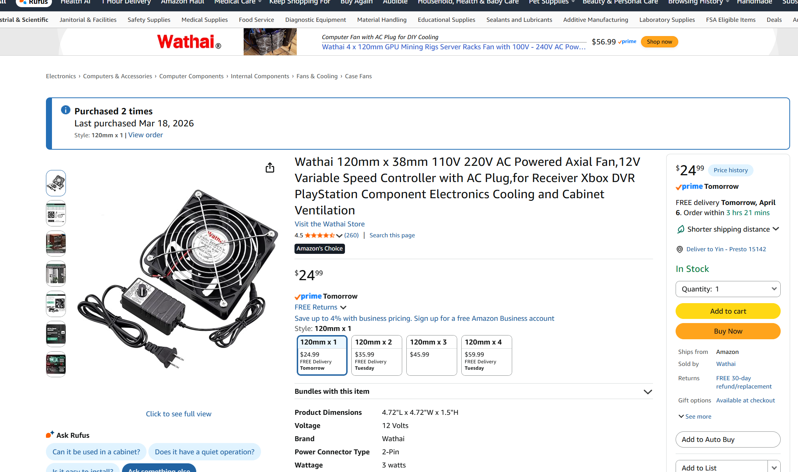
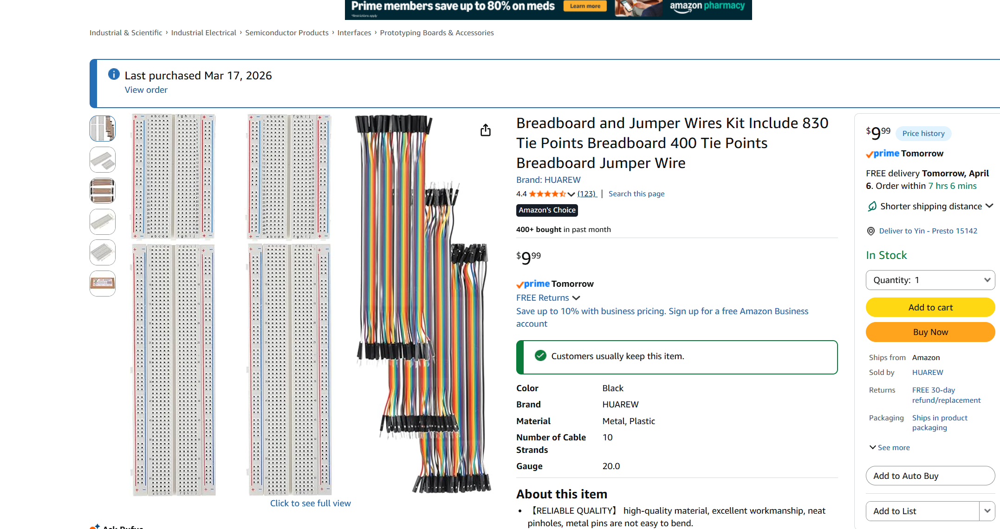
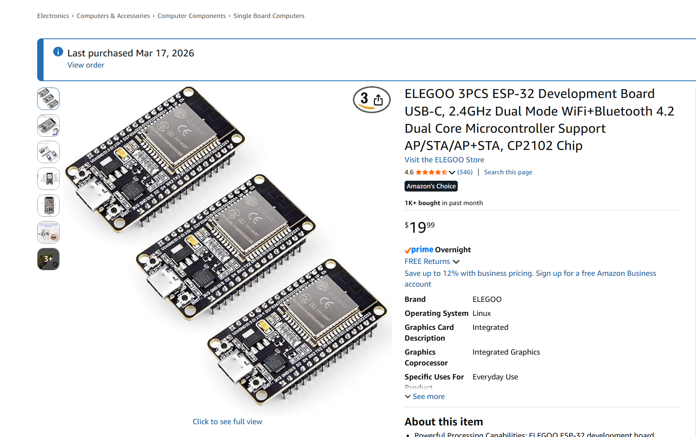
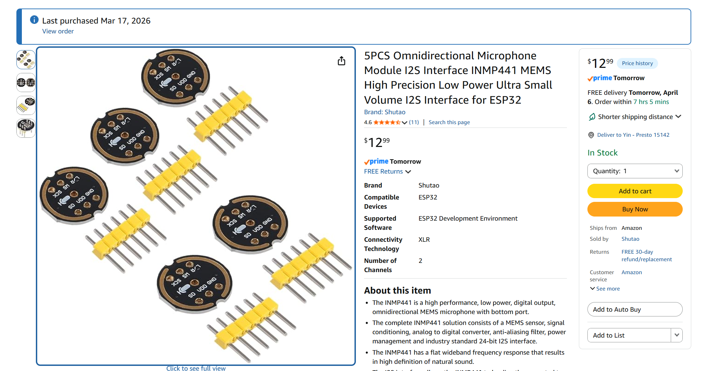
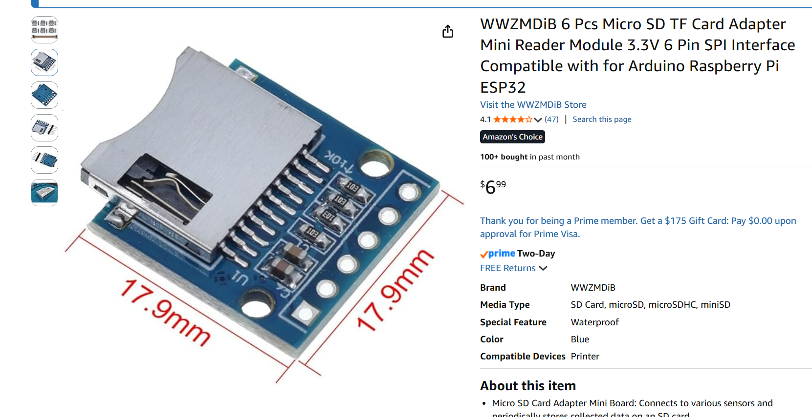

# Hardware and Materials List

This file summarizes the main hardware and materials purchased or used for our acoustic anomaly detection project. These components support fan operation, microphone-based sound acquisition, ESP32-based sensing, and circuit prototyping.

## Hardware List

| Item | Quantity | Purpose | Unit Price |
|---|---:|---|---:|
| Razer Seiren V3 Mini USB Microphone | 1 | External microphone for demo recording and live audio testing | $47.19 |
| Wathai 120mm AC Powered Axial Fan | 2 | Fan device used for acoustic experiments | $35.99 |
| Breadboard and Jumper Wires Kit | 1 | Circuit prototyping and hardware connection | $9.99 |
| ELEGOO ESP32 Development Board | 1 | Embedded sensing and data acquisition platform | $19.99 |
| INMP441 I2S MEMS Microphone Module | 1 | Digital microphone module for ESP32-based sound capture | $12.99 |
| Micro SD TF Card Adapter Module | 1 | Optional local storage interface for embedded data logging | $6.99 |

## Notes

- The hardware listed above was used for fan sound acquisition, embedded audio sensing, demo development, and experimental validation.
- Receipt screenshots are attached separately for items purchased by the team.

* **Purchaser:** All hardware items listed above were purchased by our teammate, **Zexi Yin**. 

# Receipts

