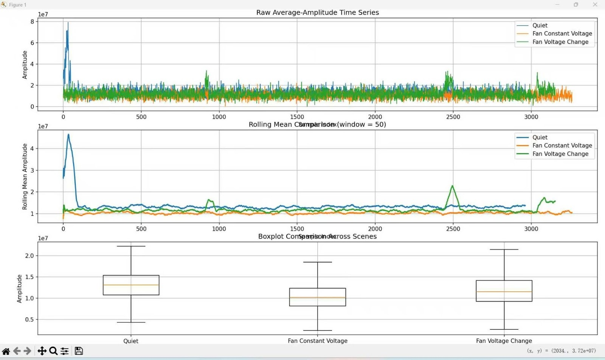
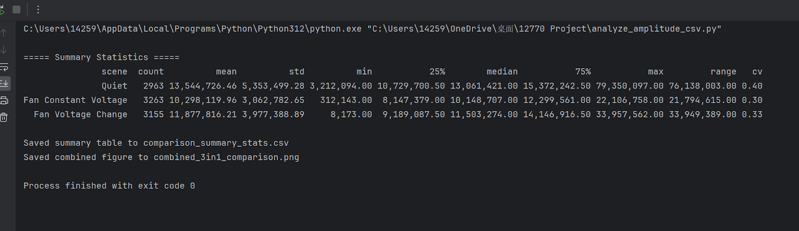
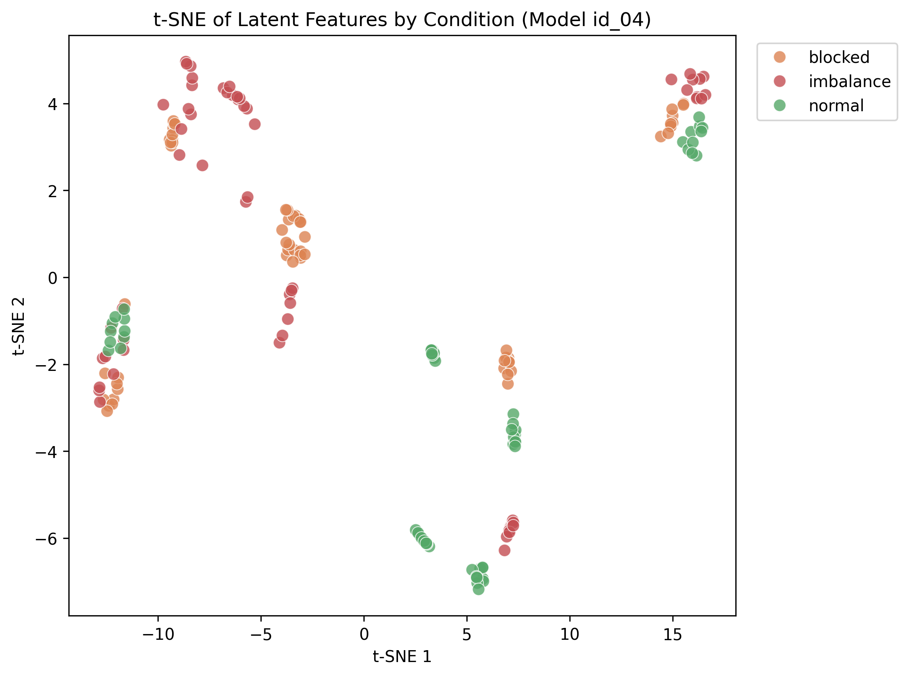
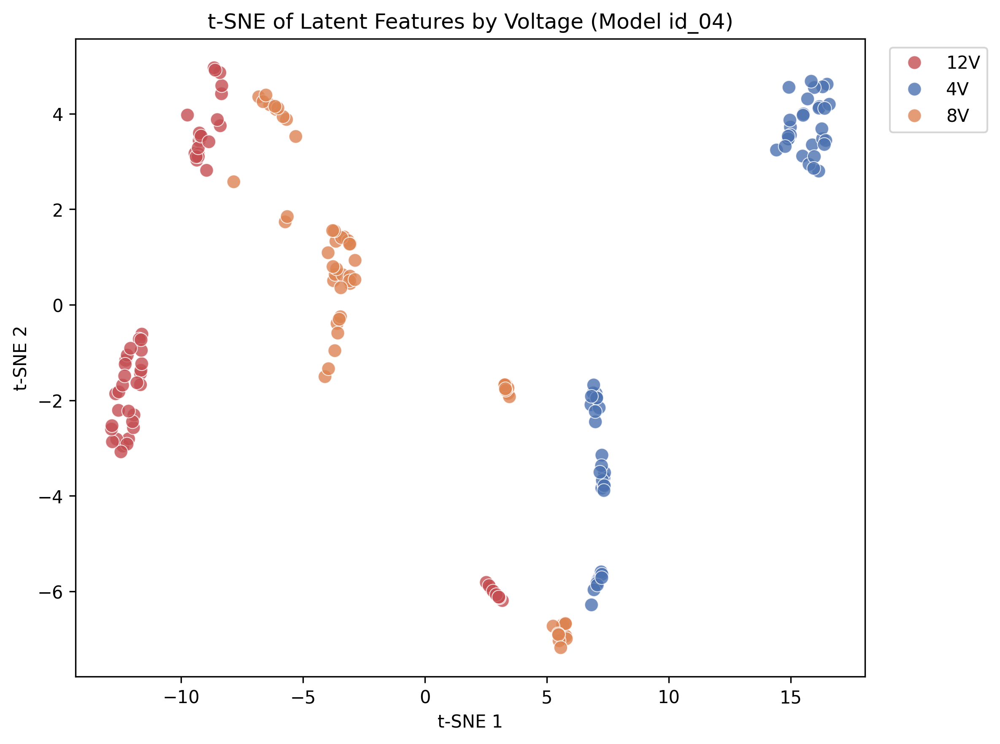
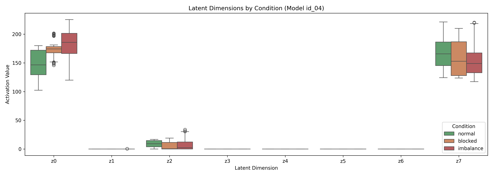
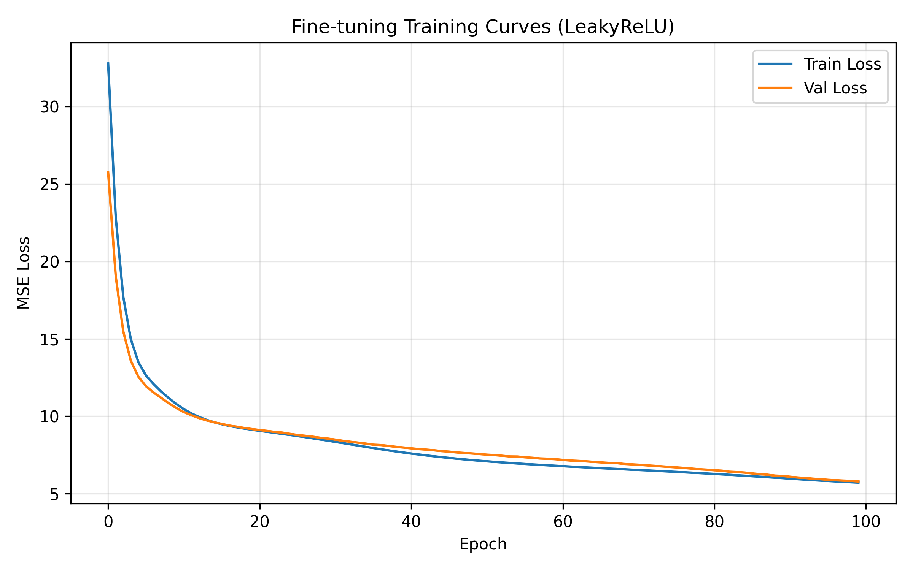
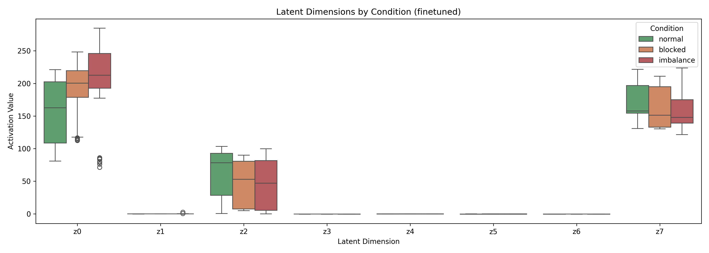
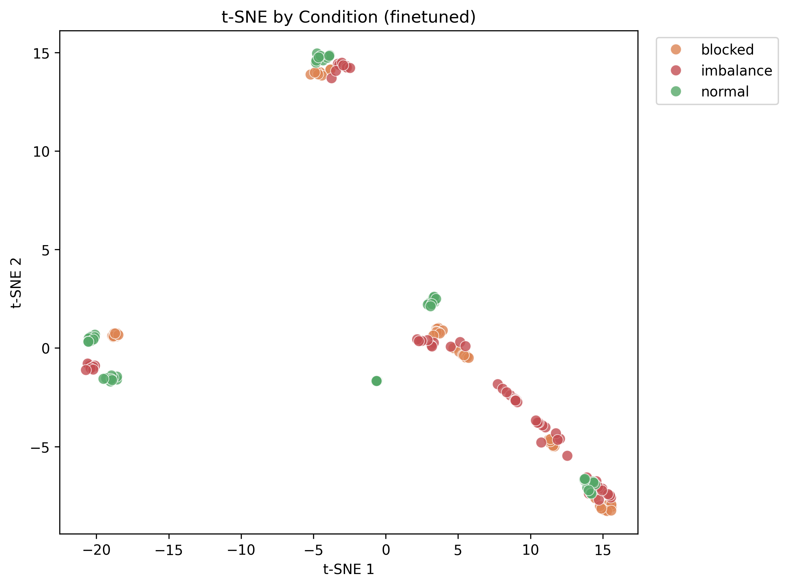

# 12-770 Project Experiment Progress

This page documents the weekly progress of our 12-770 course project on acoustic anomaly detection for small fan and HVAC-like systems. Our work combines hardware setup, real-world audio acquisition, signal analysis, baseline model development, and interactive demo deployment.

At the current stage, the project has progressed through three major phases:

- **Week 1-2:** hardware setup and sensing pipeline debugging  
- **Week 3:** signal stabilization, preliminary analysis, and baseline model training  
- **Week 4:** demo deployment and real-world recording experiments  
- **Week 5:** cross-model transfer evaluation, latent analysis, fine-tuning, and problem reframing around domain shift

The long-term goal of this project is to build a practical anomaly detection pipeline that can distinguish normal and abnormal fan operating conditions from sound recordings, and later adapt the system more closely to our own physical setup through fine-tuning.

---

## Week 1-2 – Hardware Setup and Debugging

During the first week, the main focus was on building a functional sensing pipeline using the ESP32 and the INMP441 I2S microphone. The setup involved wiring the I2S interface (`WS`, `SCK`, `SD`), configuring the ESP32 I2S driver, and streaming acquired data through serial communication.

### Issues Encountered

Several problems were identified during the initial setup phase:

- The system repeatedly produced all-zero signal output.
- This indicated that the I2S data stream was not being received correctly.

### Potential Causes Investigated

The following possible causes were tested during debugging:

- Incorrect wiring, especially mismatches among `WS`, `SCK`, and `SD`
- Improper `L/R` pin connection, leading to channel selection issues
- Sampling rate or buffer configuration mismatch
- Serial bandwidth limitations affecting output interpretation

### Debugging Process

To isolate the problem, the following steps were taken:

- Verified the wiring against the microphone datasheet
- Ensured that the `L/R` pin was fixed rather than left floating
- Switched from printing raw samples to reporting aggregated amplitude values
- Adjusted sampling rate and buffer settings
- Tested different serial baud rates

### Week 1-2 Outcome

By the end of Week 2, a stable data acquisition pipeline had been established, and the microphone was confirmed to output valid non-zero signals.

---

## Week 3 – Signal Stabilization, Preliminary Analysis, and Baseline Model Training

In the second week, the project moved from hardware debugging to signal quality improvement, preliminary signal validation, and the setup of the baseline anomaly detection model. The goal was not only to confirm that the sensing system could capture meaningful differences across operating conditions, but also to begin constructing the machine-learning pipeline that will later support anomaly detection.

### Key Improvement

A major issue involving distorted or difficult-to-interpret output was addressed.

- The system was modified to use window-based average amplitude rather than unstable raw sample inspection.
- This significantly improved signal stability and interpretability.

### Experimental Setup

Three scenarios were recorded for comparison:

1. **Quiet** — baseline condition with laptop background noise  
2. **Fan at constant voltage**  
3. **Fan under varying voltage**

All experiments were conducted under real-world conditions with persistent environmental noise from laptop operation.

### Data Analysis

The collected data were analyzed in Python using:

- time-series plots
- rolling mean
- histogram
- boxplot

Results are shown below:

### Observations

#### Clear separability between scenarios

- **Quiet** showed the highest mean amplitude and the largest variance, reflecting random ambient noise.
- **Fan at constant voltage** showed the lowest variance, indicating a stable mechanical operating condition.
- **Fan under varying voltage** showed an intermediate mean with stronger fluctuations, reflecting dynamic system behavior.

#### Rolling mean trends

- **Fan at constant voltage** exhibited a stable baseline.
- **Fan under varying voltage** showed visible spikes and fluctuations over time.

#### Distribution differences

- **Fan at constant voltage** had the most concentrated distribution.
- **Quiet** had the widest spread.
- **Fan under varying voltage** showed a moderate spread with noticeable spikes.

### Key Insight

Even in the presence of persistent background noise, the system was able to distinguish among different operating conditions. This suggests that amplitude-based features are both robust and sensitive to mechanical state changes.

### Baseline Model Training Pipeline

In parallel with signal analysis, we also established the baseline model training pipeline for acoustic anomaly detection. The objective of this stage was to convert raw audio into structured spectral features and train a reconstruction-based model that can later be used to distinguish normal and abnormal operating sounds.

#### Audio Preprocessing

The input `.wav` files are first loaded as floating-point waveforms and resampled to **16,000 Hz**. This standardizes the sampling rate while preserving the dominant frequency content relevant to fan anomaly detection.

Next, **Short-Time Fourier Transform (STFT)** is applied with:

- `n_fft = 1024`
- `hop_length = 512`

This transforms the waveform into a time-frequency representation, allowing the model to capture how spectral content evolves over time.

The linear-frequency spectrum is then mapped to **64 mel bands**, producing a compact mel-spectrogram representation. After that, the mel-spectrogram is converted to **log-mel energy**, which compresses the dynamic range and improves numerical stability for learning.

#### Frame Stacking

Instead of using one spectral frame at a time, the model stacks **5 consecutive frames** together. Since each frame contains **64 mel coefficients**, this results in a **320-dimensional input vector**:

- `64 mel coefficients × 5 frames = 320 dimensions`

This step allows the model to capture short-term temporal context rather than relying only on a single instantaneous spectral snapshot.

#### Vector Sequence Generation

For each audio clip, frame stacking is applied in a sliding-window manner across the full signal. As a result, one audio file is converted into a sequence of 320-dimensional vectors.

This design increases the effective number of training samples and allows file-level anomaly scores to be computed by aggregating reconstruction errors across many local feature vectors.

### Model Architecture

The baseline anomaly detector is implemented as a fully connected autoencoder.

#### Architecture

- **Input Layer:** 320
- **Encoder:** 320 -> 64 -> 64 -> 8
- **Decoder:** 8 -> 64 -> 64 -> 320

The hidden layers use **ReLU** activation functions to provide nonlinear representation power, while the output layer remains linear so that the reconstructed output can match the continuous log-mel feature space.

The **8-dimensional bottleneck layer** forces the network to retain only the most salient structure of normal acoustic patterns. As a result, abnormal sounds are expected to be reconstructed less accurately.

### Training Objective

The model is trained using **mean squared error (MSE)** between the input vector and the reconstructed output:

- lower reconstruction error indicates stronger consistency with learned normal patterns
- higher reconstruction error suggests possible abnormality

This makes MSE suitable both as the **training loss** and as the **anomaly score** during inference.

### Week 3 Outcome

By the end of Week 3, the project had achieved progress on both the sensing and modeling sides:

- stabilized the signal acquisition process
- confirmed separability among multiple operating conditions
- established the baseline audio preprocessing pipeline
- implemented the baseline autoencoder architecture
- prepared the model training framework for reconstruction-based anomaly detection

---

## Week 4 – Demo Deployment and Real-World Recording Experiments

In the third week, the project progressed from offline analysis and baseline model setup to interactive demonstration and real-world recording validation. The main focus was on building a working demo interface, testing the model with externally recorded fan sounds, and extending the system from offline uploaded-audio analysis to browser-based live microphone inference.

### Demo Development

During this stage, we built an interactive demo for anomaly detection. The demo was designed to support both uploaded audio analysis and live microphone analysis using the same preprocessing and reconstruction-based inference pipeline.

The updated demo now supports:

- audio upload for offline testing
- model inference using the established autoencoder pipeline
- threshold-based prediction output
- interpretable display of reconstruction-based anomaly results
- live microphone streaming directly from the browser
- rolling-window analysis for near-real-time prediction updates

In live mode, the browser continuously streams microphone audio to the backend. Instead of analyzing each tiny chunk independently, the system maintains a rolling buffer containing the most recent **10 seconds** of audio. After at least **2 seconds** of signal have been accumulated, the backend begins inference and updates the prediction every **1 second**. At each update, the buffered waveform is converted into stacked log-mel features and passed through the four trained models to generate anomaly scores and threshold-based decisions.

This step was important because it connected the modeling pipeline to a user-facing interface and made the anomaly detection results easier to test and interpret in practice.

### Smartphone Recording Experiment

To evaluate the system under more realistic conditions, we conducted a new set of recording experiments using a smartphone microphone.

#### Recording Setup

The smartphone was positioned:

- **15 cm away from the fan**
- at an angle of **45 degrees** relative to the outlet side of the fan

Three voltage conditions were tested:

- **4 V**
- **8 V**
- **12 V**

For each voltage level, two groups of experiments were conducted:

1. **Normal fan operation**
2. **Blocked condition**, in which a board higher than the fan was placed in front of it to partially obstruct the airflow during recording

### Experimental Purpose

The goal of this experiment was to determine whether the system could capture meaningful acoustic differences not only across different operating voltages, but also between normal and disturbed airflow conditions.

This experiment also served as an important intermediate step between controlled baseline data and future fine-tuning on real fan recordings.

### Observations from Smartphone Recordings

From the smartphone recordings, the acoustic difference between the two operating groups was clearly perceptible.

Key observations included:

- under the same voltage, the blocked fan produced a noticeably different sound pattern from the normal fan
- changes in voltage also led to audible variation in fan behavior and sound intensity
- the combination of multiple voltages and two physical operating conditions created a richer and more realistic testing set for the demo

These results suggest that the fan sound contains meaningful acoustic signatures related both to operating intensity and to physical disturbance conditions.

### Real-Time Demo Experiment

In addition to offline recording tests, we further developed and tested a real-time demo workflow based on browser microphone streaming.

In this setup:

- the browser microphone was used as the live input source
- audio was continuously streamed to the backend during recording
- the backend maintained a rolling 10-second audio buffer
- the system began prediction after the first 2 seconds of signal had been collected
- the four-model inference results were refreshed every 1 second
- the live diagnostic output was displayed directly in the demo interface

This design provided a much more practical form of online anomaly monitoring than the earlier file-only workflow. Rather than waiting for a recording to finish before processing, the system could continuously evaluate the most recent segment of incoming sound and update the results interactively.

This experiment was an important step toward live anomaly detection, since it moved the system closer to practical deployment rather than relying only on pre-recorded `.wav` files.

### Week 4 Outcome

By the end of Week 3, the project had achieved the following progress:

- built a working anomaly detection demo interface
- validated the system on smartphone-recorded fan audio
- tested multiple voltage conditions under real recording settings
- compared normal fan operation with a physically blocked condition
- confirmed that the recorded sounds show clear perceptual differences
- implemented browser-based live microphone streaming in the demo
- realized rolling-window real-time anomaly detection with periodic prediction updates

---

## Week 5 – Transfer Evaluation, Latent Analysis, and Domain Shift Reframing

In Week 5, the project shifted from demo development to systematic model evaluation and problem reframing. The main focus was on two parallel efforts: (1) completing a full experimental evaluation pipeline — including cross-model transfer evaluation, latent feature analysis, and fine-tuning with architecture modification — and (2) reframing the project's core problem around **domain shift in acoustic anomaly detection**, informed by a review of the DCASE literature.

### Problem Reframing: Domain Shift

Through reviewing the DCASE challenge literature (Wilkinghoff et al., 2025), we identified that our project addresses a domain shift scenario that is substantially more extreme than existing DCASE benchmarks. While DCASE studies typically vary 1–2 factors within the same recording infrastructure, our setup changes **all factors simultaneously**:

| | MIMII Source | DCASE Target | Our Target |
|---|---|---|---|
| Fan | Industrial fan | Same type, different unit | Wathai 120mm AC axial fan |
| Microphone | TAMAGO-03 array, 8-ch | Same | Razer Seiren V3 Mini, 1-ch |
| Mic grade | Research-grade | Same | Consumer USB |
| Noise | Post-hoc mix at exact SNR | Same method, different SNR | Natural ambient (uncontrolled) |
| Environment | Hitachi lab, Japan | Same facility | Different facility |
| **Factors changed** | — | 1–2 | **All simultaneously** |
| **Threshold shift** | — | ~1.5–3x | **~5–10x** |

This reframing sharpened the project narrative: we are not just "doing anomaly detection," but specifically evaluating whether domain adaptation methods remain effective under extreme cross-hardware domain shift — a scenario that is underexplored in the literature but highly relevant to real-world deployment.

### Cross-Model Transfer Evaluation

We evaluated all 4 pretrained MIMII baseline autoencoders (id_00, id_02, id_04, id_06) on our 180-sample target dataset (3 conditions × 3 voltages × 2 noise environments × 10 runs).

Key findings:
- **id_04** achieved the best transfer performance (AUC = 0.769, F1 = 0.846)
- Source-domain performance **does not predict** transfer performance: id_06 (best on source, F1 = 0.910) transferred poorly (F1 = 0.818), while id_04 (mediocre on source, F1 = 0.731) transferred best
- Optimal thresholds shifted by 5–10x (source ~5–7 vs. target ~35–58), confirming extreme domain mismatch
- The condition ranking (imbalance > blocked > normal in MSE) was consistent across all 4 models

We also compared source-domain results (from classmate's evaluation on original MIMII test data) with our target-domain results, providing a direct quantification of domain shift severity.

### Latent Feature Analysis & Multi-Class Classification

Using the best model (id_04), we extracted the 8-dimensional bottleneck representations and performed:

- **Per-dimension analysis**: Discovered that **only 2 of 8 latent dimensions (z0 and z7) are active**; z1–z6 are dead (zero-valued) due to ReLU activation at the bottleneck
- **t-SNE visualization**: Revealed a hierarchical latent structure — condition (normal/blocked/imbalance) at the coarse level, voltage (4V/8V/12V) at the fine level, with noise environment (quiet/noise) well-mixed within clusters (indicating noise robustness)
- **Multi-class classification**: Random Forest achieved **95.0% 3-class accuracy** (5-fold CV) on the 8-dim latent features without any fine-tuning or supervised training — demonstrating that the pretrained encoder already encodes condition-discriminative information

### Fine-Tuning with Architecture Modification

Based on the dead-neuron finding, we made a single architectural change (bottleneck ReLU → LeakyReLU) and fine-tuned the autoencoder on our 60 normal-condition samples (48 train / 12 val), using only MSE reconstruction loss.

Results:

| Metric | Baseline (frozen) | Fine-tuned | Change |
|--------|-------------------|------------|--------|
| AUC (binary) | 0.769 | **0.997** | +0.228 |
| Best F1 (binary) | 0.846 | **0.984** | +0.138 |
| Optimal threshold | 38.18 | **7.56** | Back to source-domain scale |
| Active latent dims | 2/8 | **4/8** | +2 dims activated |
| 3-class accuracy (RF) | 95.0% | 95.0% | Maintained |

The threshold returning from 38.18 to 7.56 (matching the source-domain scale of 5–7) is direct evidence that fine-tuning successfully eliminated the domain shift. The newly activated dimension z2 shows clear condition-dependent variation, providing additional discriminative information.

### Week 5 Outcome

- Completed cross-model transfer evaluation across 4 pretrained models with source-vs-target comparison
- Discovered that 6/8 bottleneck dimensions are dead in the pretrained model
- Demonstrated 95% 3-class fault classification from pretrained latent features
- Achieved near-perfect anomaly detection (AUC = 0.997) through fine-tuning + LeakyReLU
- Reframed the project problem around extreme cross-hardware domain shift, differentiating from DCASE literature
- Produced a comprehensive experimental report (LaTeX) covering all findings

## Summary of Progress So Far

Across the first three weeks, the project has achieved the following milestones:

- established a working ESP32 + INMP441 sensing pipeline
- resolved hardware-level data acquisition issues
- improved signal stability through window-based amplitude processing
- collected preliminary recordings under multiple operating conditions
- confirmed that the system can capture distinguishable patterns across different fan states
- established the baseline feature extraction and model training pipeline for acoustic anomaly detection
- built an interactive demo for reconstruction-based anomaly detection
- tested the system with smartphone-recorded fan audio under multiple voltage conditions
- implemented rolling-window live microphone analysis in the demo
- completed cross-model transfer evaluation (4 MIMII models) and identified id_04 as best-transferring
- discovered 6/8 latent bottleneck dimensions are dead due to ReLU; only 2 dimensions carry information
- demonstrated 95% three-class fault classification from pretrained latent features without supervised training
- fine-tuned with LeakyReLU bottleneck modification, recovering AUC from 0.769 to 0.997
- reframed project problem around extreme cross-hardware domain shift (5–10x threshold shift vs. DCASE's 1.5–3x)
- produced comprehensive experimental and evaluation report in LaTeX

## Next Steps

The next phase of the project will focus on:

- **Stage 2 multi-task learning**: attaching a classification head to the bottleneck for end-to-end 3-class training (reconstruction + classification joint loss)
- **Ablation experiments**: separating the contributions of LeakyReLU vs. fine-tuning to understand each factor's impact
- **Additional DA method comparison**: testing domain-specific score normalization and Mahalanobis distance against fine-tuning
- **ESP32 + INMP441 deployment**: migrating from USB microphone to embedded MEMS module and evaluating the additional sensor-grade domain shift
- preparing final report, poster, and demonstration materials

# What We Learned:

Through this assignment, our team reached a strong consensus on our system architecture and experimental validation strategies. Here is what each team member learned during this phase:

### **Tanghao Chen**:

Through deploying our Gradio-based interactive diagnostic demo, I gained a deep understanding of setting scientific decision boundaries. By analyzing validation score distributions, I configured precise MSE thresholds (e.g., 6.9, 6.0, 5.3, 7.0) for four machine IDs. A major learning point was balancing response speed and diagnostic stability during live microphone integration. I implemented a 10-second rolling buffer that accumulates 2 seconds of audio before updating predictions every second. Mastering this tradeoff between "time window length" and "interpretability" in real-time engineering was my core takeaway, laying the groundwork for future model adaptation in real physical environments.

### **Yizhen Xu**:

My primary focus was building and training the anomaly detection models using the MIMII dataset to accurately classify the operational status of fan motors. I gained hands-on experience by implementing and comparing two distinct architectures: a baseline Dense Autoencoder (DenseAE) and a Residual Autoencoder (ResidualAE). Throughout the optimization process, I learned the critical importance of robust training strategies. I experimented with various techniques to improve model generalization, including injecting synthetic data noise, modifying the underlying network structures, and systematically tuning hyperparameters. These iterative refinements significantly deepened my understanding of autoencoder behaviors in acoustic anomaly detection.

### **Zexi Yin**:

My key learning revolved around the complexities of real-time acoustic data acquisition. Initially building an ESP32 + INMP441 system, I spent significant time debugging issues like discontinuous signals and serial bandwidth bottlenecks at high sampling rates, eventually pivoting to SD card local storage. To ensure our demo progressed smoothly, I engineered a stable PC-based USB microphone pipeline featuring real-time recording and waveform/spectrogram visualization. Resolving buffer and shape mismatch errors taught me how to effectively manage audio data structures. Ultimately, transitioning from offline audio to window-sliced real-time streaming was a crucial structural agreement our team reached this week.

My key learning this phase evolved from hardware debugging to systematic model evaluation and research methodology. Building on the ESP32 + INMP441 sensing pipeline from earlier weeks, in Week 5 I led the experimental evaluation effort: designing and executing the cross-model transfer evaluation across 4 pretrained MIMII autoencoders, performing latent feature analysis (t-SNE, per-dimension activation, multi-class classification), and implementing the fine-tuning pipeline with LeakyReLU architectural modification. A critical insight was discovering that 6 of 8 bottleneck dimensions were dead due to ReLU — a finding that directly motivated the architecture change and led to AUC improving from 0.769 to 0.997. Through reviewing the DCASE domain shift literature, I also helped reframe the project's core narrative: we are not just doing anomaly detection, but specifically validating domain adaptation under extreme cross-hardware shift — a scenario substantially more severe than existing DCASE benchmarks. This experience taught me how to connect experimental findings to a broader research context and articulate what makes our work different.

